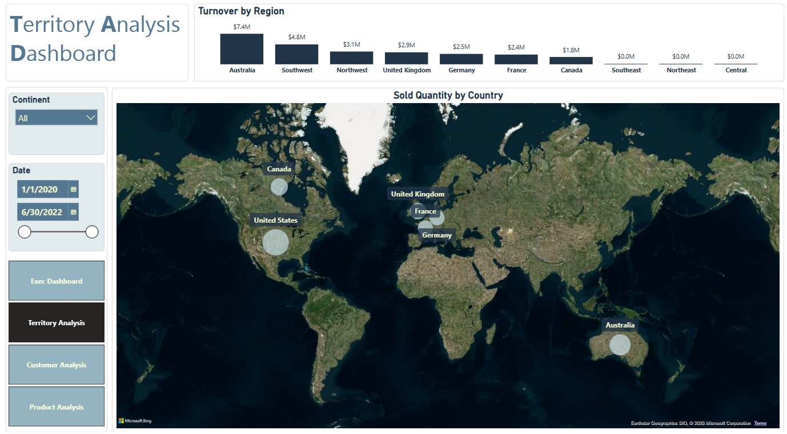

# Power BI Sales Analysis Dashboard

This project features an interactive **Power BI dashboard** for analyzing sales performance across products, regions, and customers between **January 2020 – June 2022**.

---
## Live Dashboard Preview
[View on Power BI Service](https://app.powerbi.com/view?r=eyJrIjoiMGJjOGFjZGQtOWUyYS00MjA5LTgwYTQtNGE3ZGQ4YmE0N2Q3IiwidCI6ImQxNzcyNDUxLTYxMmUtNDljZS1iNjUzLWYxYThkMjI4MmZmZCJ9)

---
## Dataset
[Dataset link](https://www.kaggle.com/datasets/sadia21121/adventure-bike-sales-dataset)

---

## Pages Overview

- **Executive Dashboard** – Overall KPIs, trends, top products
- **Territory Analysis** – Turnover by region, global sales distribution
- **Customer Analysis** – Customer segmentation, trends, top customers
- **Product Analysis** – Deep dive into product profitability and order volumes

---

## Files Included

| File/Folder | Description |
|-------------|-------------|
| `Adventure_Work_Sales_Dashboard.pbix` | Main Power BI file |
| `Exported_Visuals/` | PNG screenshots of each dashboard page |

---

## Key Insights

- **Total Turnover:** $24.9M, **Profit Margin:** 42%
- **Return Rate:** 2.2%, **Top-selling Category:** Accessories
- **Top Regions:** Australia and the Southwest
- **Top Customers:** Mr. Maurice Shan and Mrs. Janet Munoz
- **Top Product:** Water Bottle - 30 oz (3,983 orders)

---

## Tools Used

- Power BI Desktop
- DAX for measures and KPIs
- Power Query for transformation
- Adventure Works dataset
---

## Dashboard Preview

### Executive Dashboard  

### Territory Analysis  

### Customer Analysis  

### Product Analysis  

---

## Business Value

This dashboard helps stakeholders:

- Monitor performance trends and KPIs
- Identify top and underperforming regions/products
- Understand customer behavior and segmentation
- Support data-driven product and pricing decisions

---

## Author

**Sadia Hossain**  
MSc Data Science | SQL • Python • Power BI  
sadiahossain2101@gmail.com  
[LinkedIn](https://www.linkedin.com/in/sadia-hossain-297993251/)

